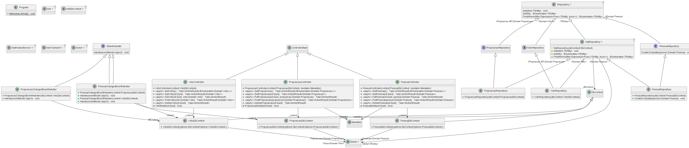
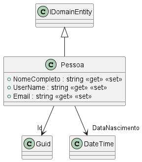
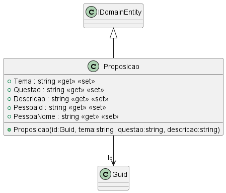
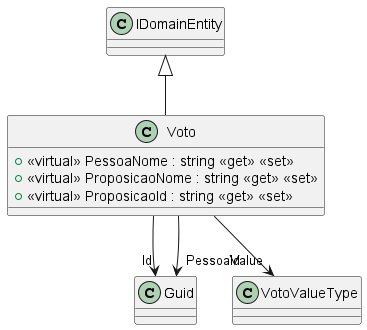

- [**Documento de Visão Geral da Solução**](#documento-de-visão-geral-da-solução)
  - [**Introdução**](#introdução)
    - [**Descrição do problema**](#descrição-do-problema)
    - [**Descrição geral do sistema**](#descrição-geral-do-sistema)
    - [**Restrições de escopo**](#restrições-de-escopo)
    - [**Referências**](#referências)
    - [**Futuras Implementações**](#futuras-implementações)    
  - [**Casos de Uso**](#casos-de-uso)
    - [**UC1. Cadastro de pessoa**](#uc1-cadastro-de-pessoa)
    - [**UC2. Edição de pessoa**](#uc2-edição-de-pessoa)
    - [**UC3. Obter pessoas cadastradas**](#uc3-obter-pessoas-cadastradas)
    - [**UC4. Obter pessoa cadastrada por ID**](#uc4-obter-pessoa-cadastrada-por-id)
    - [**UC5. Remover pessoa**](#uc5-remover-pessoa)
  - [**Desenho do domínio de negócios**](#desenho-do-domínio-de-negócios)
  - [**Desenho e modelagem de arquitetura**](#desenho-e-modelagem-de-arquitetura)
    - [**Diagram de arquitetura**](#diagram-de-arquitetura)
    - [**Diagrama de classes**](#diagrama-de-classes)
      - [Arquitetura geral](#arquitetura-geral)
      - [Pessoa](#pessoa)
      - [Proposição](#proposição)
      - [Voto](#voto)
 
# **Documento de Visão Geral da Solução**

## **Introdução**
Este documento especifica os requisitos do sistema Votum, fornecendo aos arquitetos e desenvolvedores as informações necessárias para o projeto e implementação, assim como para a realização dos testes e homologação do sistema.

### **Descrição do problema**
Atualmente um dos grandes problemas da democracia representativa se dá pela falta de conexão entre o interesse de quem vota e o interesse daquele que é eleito, bem como suas atitudes no exercício do mandato. Como forma de resolver este problema, propomos a criação de um plataforma digital composta por uma WebAPI que tem por finalidade aproximar ambas as partes do processo, tornando a mais responsável e participativa.

### **Descrição geral do sistema**
O sistema proposto é uma API desenvolvida utilizando tecnologias que tem por finalidade conectar pessoas através de seus votos sobre os mais diversos assuntos que são pauta nas casas legislativas. A partir dessas informações será possível apresentar ao usuário o seu perfil de voto e candidato mais adequado ao seu perfil.

### **Restrições de escopo**

- O voto em uma proposição deverá ser imutável, não podendo ser substítuido após o seu cadastro.
- O sistema não suportará os navegadores Internet Explorer e Netscape. 

### **Referências**
- Rizzoni, Ariadne M. B. e Chiossi, Thelma C. dos Santos. Introdução à 
Engenharia de Software. Editora da Unicamp, 2001.

## **Casos de Uso**

### **UC1. Cadastro de pessoa**

**Objetivo** : Permitir que o usuário se cadastre no sistema como pessoa física.

**Atores** : Usuário, Validador.

**Condição de entrada** : O Usuário seleciona a opção &quot;Registrar como Pessoa Física&quot;.

**Fluxo principal** :

1. O sistema apresenta formulário de cadastro contendo as informações:

   - CPF (campo editável)

   - Nome completo (campo editável)

   - E-mail (campo editável)

2. O ator _Usuário_ escolhe o botão Salvar;

3. O ator _Validador_ verifica os dados;

4. O sistema exibe o resultado da operação;

**Fluxo exceção [CPF Inválido]**:

1. O sistema apresenta janela de erro com a mensagem: &quot;CPF inválido. Por favor, confira o número e tente novamente&quot;;
2. O ator confirma a mensagem de erro;
3. O sistema retorna para a tela anterior;

### **UC2. Edição de pessoa**

**Objetivo** : Permitir que o usuário se cadastre no sistema como pessoa jurídica.

**Atores** : Usuário, Validador.

**Condição de entrada** : O Usuário seleciona a opção &quot;Registrar como Pessoa Jurídica&quot;.

**Fluxo principal** :

1. O sistema apresenta formulário de cadastro contendo as informações:

   - CNPJ (campo editável)

   - Nome empresarial (campo editável)

   - E-mail (campo editável)

2. O ator _Usuário_ escolhe o botão Salvar;

3. O ator _Validador_ verifica os dados;

4. O sistema exibe o resultado da operação;

**Fluxo exceção [CNPJ Inválido]**:

1. O sistema apresenta janela de erro com a mensagem: &quot;CNPJ inválido. Favor conferir novamente&quot;.
2. O ator confirma a mensagem de erro;
3. O sistema retorna para a tela anterior;

### **UC3. Obter pessoas cadastradas**

**Objetivo** : Permitir que o usuário se cadastre no sistema como pessoa política.

**Atores** : Usuário, Validador.

**Condição de entrada** : O Usuário seleciona a opção &quot;Registrar como Pessoa Política&quot;.

**Fluxo principal** :

1. O sistema apresenta formulário de cadastro contendo as informações:

   - Nome completo (campo editável)

   - E-mail (campo editável)

   - Função pública (campo editável)

   - Partido político (campo editável)

2. O ator _Usuário_ escolhe o botão Salvar;

3. O ator _Validador_ verifica os dados;

4. O sistema exibe o resultado da operação;

**Fluxo exceção [Função pública não suportada]**:

1. O sistema apresenta janela de erro com a mensagem: &quot;Sua função pública ainda não é suportada pelo nosso sistema. Por favor, tente mais tarde.&quot;
2. O ator confirma a mensagem de erro;
3. O sistema retorna para a tela anterior;

### **UC4. Obter pessoa cadastrada por ID**

**Objetivo** : Permitir que o usuário cadastre uma proposição.

**Atores** : Usuário

**Condição de entrada** : O Usuário devidamente logado, seleciona a opção &quot;Cadastrar Proposição&quot;.

**Fluxo principal** :

1. O sistema apresenta formulário de cadastro contendo as informações:

   - Nome da proposição (campo editável)

   - Tema (campo editável)
2. O ator escolhe o botão Salvar;

3. O sistema exibe o resultado da operação;

**Fluxo exceção [Proposição já existe]**:

1. O sistema apresenta janela de erro com a mensagem: &quot;A proposição inserida já existe em nossos bancos de dados&quot;;
2. O ator confirma a mensagem de erro;
3. O sistema retorna para a tela anterior;

### **UC5. Remover pessoa**

**Objetivo** : Permitir que o usuário vote em uma proposição legislativa.

**Atores** : Usuário

**Condição de entrada** : O Usuário devidamente logado, seleciona a opção &quot;Votar Proposição&quot;.

**Fluxo principal** :

1. O sistema apresenta formulário de voto contendo as informações:

   - Nome da proposição (lista selecionável)

   - Voto (lista selecionável fixa contendo as opções "Sim" ou "Não")
2. O ator escolhe o botão Salvar;

3. O sistema exibe o resultado da operação;

**Fluxo exceção [Voto já computado]**:

1. O sistema apresenta janela de erro com a mensagem: &quot;O seu voto já foi inserido para esta proposição.&quot;;
2. O ator confirma a mensagem de erro;
3. O sistema retorna para a tela anterior;

## **Desenho do domínio de negócios**

## **Desenho e modelagem de arquitetura**

A presente proposta de solução será desenhada e implementada por meio da arquitetura de microserviços. A partir da análise do modelo de negócios foram mapeados os seguintes sub-domínios:

- Pessoa: Sub-domínio responsável pelo cadastro e gerenciamento dos usuários e perfis de acesso dos usuário:
- Voto: Responsável pelo gerenciamento e contagem dos votos.
- Proposição: Responsável pelo cadastro e gerenciamento das proposições.

### **Diagram de arquitetura**

### **Diagrama de classes**

#### Arquitetura geral

#### Pessoa

#### Proposição

#### Voto

